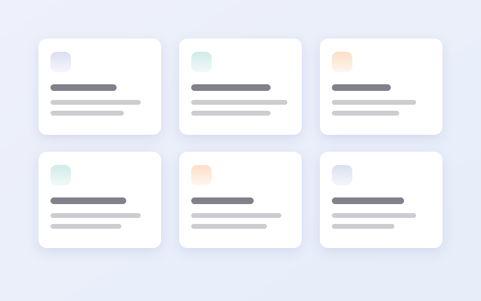
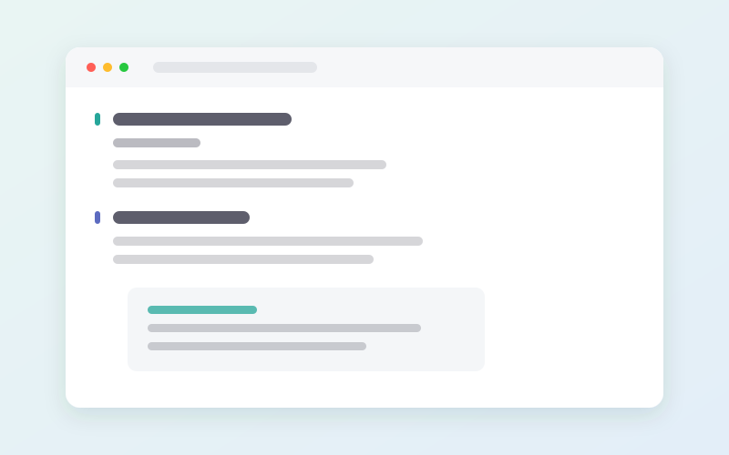
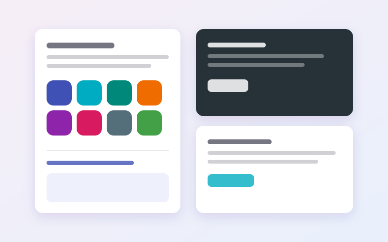
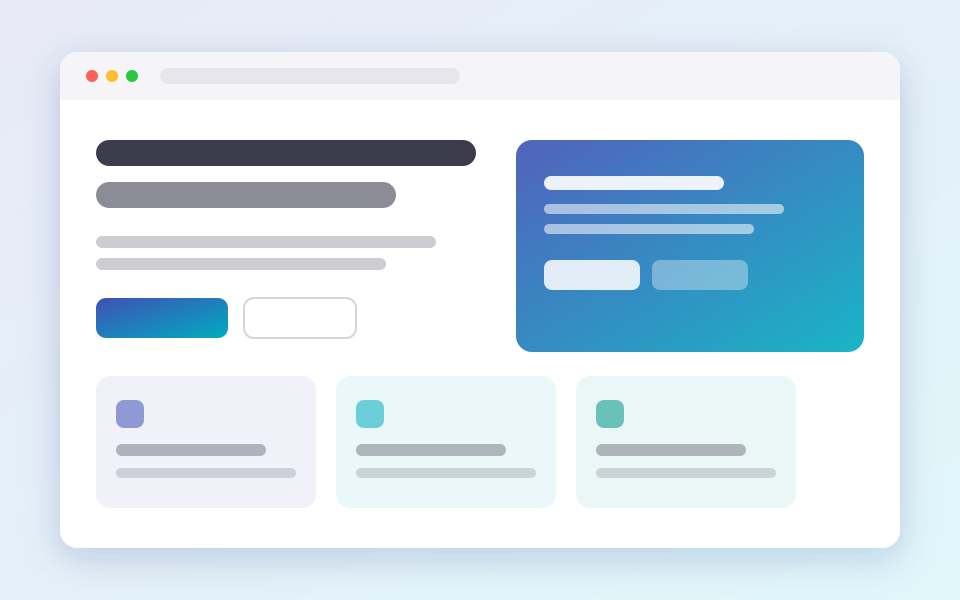

```homepage-hero
eyebrow: MkDocs · Material
title: 文档的第一屏，值得多看一眼
subtitle: 用纯 Markdown 编排首页——卡片、图文、画册、数字、引用、品牌墙，样式全部长在 Material 主题里。
gradient: true
image: assets/hero.svg
image_frame: browser
ratio: 16/10
actions:
  - 快速开始 | guide/index.md | primary | rocket-launch-outline
  - 区块总览 | guide/blocks.md | secondary | view-dashboard-outline
note: MIT 许可 · 零前端依赖 · 与 mkdocs-material 9.x 同源
highlights:
  - 16 | 区块类型 | view-dashboard-outline
  - 95 | 内置图标 | shape-outline
  - 2 | 配色方案 | layers-outline
---
顺序即文档顺序，位置、主题与栅格列数都写在区块自己的属性里——不改模板、不写 HTML、不引入框架。
```

```homepage-logos
style: marquee
colored: true
caption: 采用同一套设计语言的项目
logos:
  - simple/python | Python
  - simple/markdown | Markdown
  - simple/materialdesign | Material
  - simple/github | GitHub
  - simple/docker | Docker
  - simple/fastapi | FastAPI
  - simple/pydantic | Pydantic
  - simple/kubernetes | Kubernetes
  - simple/typescript | TypeScript
  - simple/rust | Rust
```

```homepage-features
eyebrow: 开箱可用的
title: 你应该期待的一切
subtitle: 不靠外部资源堆装饰；每一个细节都由主题的语义变量推导。
columns: 3
align: center
icon_style: soft
features:
  - title: 只用 Markdown
    icon: file-document-outline
    desc: 围栏代码块就是一块内容，属性写 YAML，长文本照旧写 Markdown。
  - title: 颜色来自主题
    icon: palette-outline
    desc: 每个主题只声明一个色相，强调色、浅底、描边与高光都由它推导。
  - title: 亮暗都正确
    icon: layers-outline
    desc: 浅底是「强调色混进主题背景色」，两套配色下对比度都稳定。
  - title: 缩放自如
    icon: speedometer
    desc: 栅格没有断点——装得下就三列，装不下自动两列、一列。
  - title: 关掉 JS 也完整
    icon: shield-check-outline
    desc: "脚本只做增强：滚动揭示的初始隐藏写在 @media (scripting: enabled) 里。"
  - title: 写错会告诉你
    icon: alert-outline
    desc: 带行号的警告，加上页面上可见的错误标记；strict 模式下直接让构建失败。
```

```homepage-showcase
eyebrow: 不止是一个静态页面
ratio: 16/10
showcase:
  - eyebrow: 结构化
    title: 卡片不只是链接块
    desc: 标题、描述、图标、徽标、标签、页脚各就各位，所以对齐与留白由样式表统一决定，而不是靠你手写空格。
    image: assets/feature-cards.svg
    features:
      - 每张卡片可以有自己的主题色
      - 鼠标移上去有轻微的视角与高光变化
      - span 与 featured 可以让它占两列
    link: guide/blocks.md
    link_text: 卡片区块
  - eyebrow: 可读性
    title: 正文就是站点的正文
    desc: 区块里的 Markdown 用站点自己启用的扩展渲染，引用块、标签页、表格、脚注都照常工作。
    image: assets/feature-syntax.svg
    reverse: true
    features:
      - 与页面正文完全一致的渲染结果
      - 只排除 toc 与 meta 这两个页面级扩展
      - 相对链接按 MkDocs 的规则解析
    link: guide/syntax.md
    link_text: 语法速查
  - eyebrow: 一致性
    title: 它长在主题上，而不是旁边
    desc: 十六个主题名，每个只声明一个色相；其余颜色都从 Material 的语义变量推导，所以换配色方案不需要改任何东西。
    image: assets/feature-theme.svg
    features:
      - 自定义 primary / accent 自动生效
      - slate 深色方案无需额外处理
      - 高对比度与「减少动态效果」都被尊重
    link: reference/index.md
    link_text: 设计约定
```

```homepage-cards
eyebrow: 内容区块
title: 十六种区块
subtitle: 顺序、位置、主题、栅格列数都由区块自己声明；缺省值已经调好，写最少的内容就能得到整齐的版面。
columns: 3
cards:
  - title: 首屏
    icon: rocket-launch-outline
    desc: 大标题、导语、按钮、配图，还可以带一组关键数字。
    link: guide/blocks.md
    badge: hero
  - title: 卡片墙
    icon: view-dashboard-outline
    desc: 3D 倾斜与跟随光标的高光，每张卡片可独立配色。
    link: guide/blocks.md
    theme: cyan
    badge: cards
  - title: 图文特写
    icon: image-outline
    desc: 图文左右交替，带要点列表与「了解更多」链接。
    link: guide/blocks.md
    theme: teal
    badge: showcase
  - title: 画册
    icon: view-gallery-outline
    desc: 原生横向滚动，保留触控板、触摸与键盘操作。
    link: guide/blocks.md
    theme: green
    badge: gallery
  - title: 引用
    icon: format-quote-open
    desc: 头像、姓名、职位，外加可选的星级评分。
    link: guide/blocks.md
    theme: amber
    badge: testimonials
  - title: 品牌墙
    icon: shape-outline
    desc: 内置 Simple Icons 品牌图标集，可灰阶、可走马灯。
    link: guide/blocks.md
    theme: orange
    badge: logos
  - title: 数字
    icon: chart-line
    desc: 滚动到可见时开始计数，前后缀自动分离。
    link: guide/blocks.md
    theme: deep-orange
    badge: stats
  - title: 步骤
    icon: timeline-outline
    desc: 纵向或横向，可用图标或自动编号。
    link: guide/blocks.md
    theme: pink
    badge: steps
  - title: 行动号召
    icon: lightning-bolt-outline
    desc: 居中的收尾区块，可以带一张配图。
    link: guide/blocks.md
    theme: purple
    badge: cta
```

```homepage-stats
eyebrow: 数字
title: 让数字自己说话
columns: 4
stats:
  - 16 | 区块类型 | view-dashboard-outline
  - 95 | 内置图标 | shape-outline
  - "99.9% | 构建稳定性 | check-circle-outline"
  - 0 | 前端依赖 | package-variant-closed
```

```homepage-gallery
eyebrow: 界面预览
title: 可滚动画册
subtitle: 原生横向滚动，按钮与圆点由脚本渐进增强；也可以在正文里直接写 Markdown 图片来生成。
mode: scroll
per_view: 2.2
ratio: 16/10
---







```

```homepage-testimonials
eyebrow: 用户评价
title: 他们怎么说
columns: 3
rating: true
testimonials:
  - quote: 我们把散落在各处的手写 HTML 首页换成了这个插件。现在加一块内容就是加一个代码块，改一行就能看到效果。
    name: 林可
    role: 平台文档负责人
    avatar: assets/avatar-1.svg
  - quote: 最难得的是它没有把主题甩掉。切换深色模式、换一套主色，首页跟着一起变，不需要再补一轮样式。
    name: 陈屿
    role: 前端工程师
    avatar: assets/avatar-2.svg
    theme: teal
  - quote: 区块正文和页面正文渲染一致这一点非常关键——引用块、标签页、表格都不需要单独适配。
    name: 苏禾
    role: 技术写作者
    avatar: assets/avatar-3.svg
    theme: amber
```

```homepage-split
ratio: 1.15 1
divider: true
---
### 用纯 Markdown 写首页

一整页都是普通的 `.md` 文件。围栏里写属性，围栏外写正文，中间用单独一行的 `---` 分开。

- 不需要学新的模板语法
- 不需要维护一套 HTML
- 也不需要为深色模式补第二份样式

正文里的列表、引用、行内代码都按文章本身的节奏渲染，只有区块自己的外壳被重新定义。

===
### 需要更细的控制

就给区块加一个 `class`，用你自己的 CSS 收尾。插件只声明变量与语义类名，不锁死实现：

`.md-home--theme-cyan .md-home__card { --md-home-radius: 1em; }`

可以覆盖的变量有圆角、间距、内边距、栅格最小宽度与默认色相，足够应付绝大多数微调。
```

```homepage-anim
effect: marquee
duration: 30s
---
**顺序即文档顺序** · 属性写在围栏里 · 颜色来自主题 · 亮暗自动成立 · 无前端依赖 · 95 个内置图标 · 16 种区块 · 写错有行号
```

```homepage-cta
eyebrow: 开始使用
title: 五分钟，把首页换掉
subtitle: 安装插件，加一行配置，然后写下你的第一个围栏代码块。
align: center
pattern: aurora
gradient: true
actions:
  - 快速开始 | guide/index.md | primary | rocket-launch-outline
  - 区块总览 | guide/blocks.md | secondary | view-dashboard-outline
note: 拿不准从哪开始？先看设计约定，那里解释了每一个决定的来由。
```

```homepage-links
title: 下一步
style: buttons
columns: 3
links:
  - 快速开始 | guide/index.md | 三步启用插件 | rocket-launch-outline
  - 语法速查 | guide/syntax.md | 属性、正文与分隔线 | text-box-outline
  - 区块总览 | guide/blocks.md | 十六种区块一览 | view-dashboard-outline
```
